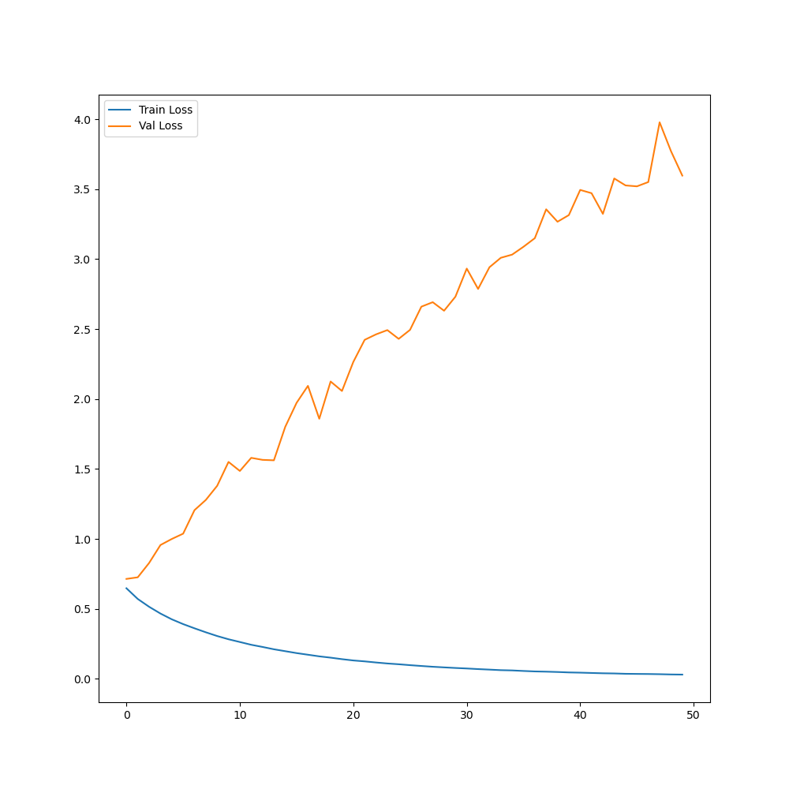
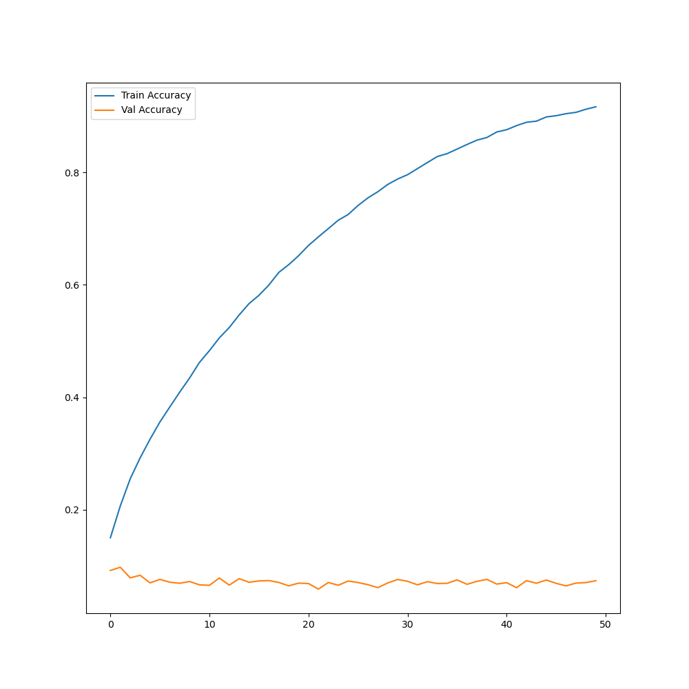

# Contrastive predictive coding - NLP
- This repository contains an implementation of the NLP experiment conducted in the original CPC paper (2018)
- This project was conducted for the Machine Learning II course, which is part of the first year of the Master's degree program in Computer Science at the University of Mons
- Link to the original [paper](https://arxiv.org/abs/1807.03748)

## Results
- The model has been trained on a limited subset of the bookcorpus dataset due to computational constraints.
- The sentence encoder, with both random and trained weights, was evaluated using the TREC dataset with coarse labels.

### Train results
Loss          |  Accuracy
:------------:|:---------:
 | 

###  TREC results
| model_name | train_accuracy | test_accuracy |
|:----------------|-----------------:|----------------:|
| random_encoder | 0.393617 | 0.428 |
| trained_encoder | 0.701027 | 0.764 |

## Usage
- Run python main.py
- See configuration files in configs directory
